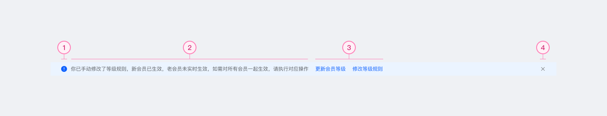

## 用法

### 什么时候用
- 您想通知用户有关对象状态的信息
- 您要警告用户有关问题
### 什么时候不用
- 您想显示在Form组件上

## 构成元素

1. 带语义元素的图标
2. 文本内容
3. 操作区（可选）最多2个
4. 关闭操作（可选）

<iframe width="100%" height="450" src="https://www.figma.com/embed?embed_host=share&url=https%3A%2F%2Fwww.figma.com%2Ffile%2FUwm3hgWVXb0AOmc1r2DF1y%2FCabin-X--PC-Library%3Fnode-id%3D14086%253A20592"></iframe>

## 行为和交互

### 静态行为

消息条充当信息栏。如果要显示与对象有关的状态，请保持交互静态，并且不显示“关闭”按钮。

### 互动行为

单击右侧的“ 关闭”按钮可隐藏消息条。

## 相关组件对比

[用法](https://www.notion.so/3775ac1d82b8422da2dfbd69c3ddebae)

# 组件在容器的规则 （布局）

1. 放置在根结点容器（Page/Drawer/Pop）和Module中，且一个容器中只允许放置一个，始终处于最上层
2. 字数不做限制，从宽度上限制，文本永远只展示一行，超出...（Actions最大宽度为176PX）接在文本后面
    

    

## 组件在各端的变化

### 移动端

1. 内容溢出变化：默认只展示一行内容，超出... （Actions最大宽度为100PX）

## 组件负责人

1. 前端 @杨小英 
2. 设计 @fan lee 

## 过程记录
